# 🌐 Host File Mapping & Port Forwarding in Kubernetes

## 🔹 Host File Mapping

### What is it?
- The **hosts file** (`/etc/hosts` on Linux/Mac, `C:\Windows\System32\drivers\etc\hosts` on Windows) is used to map **hostnames → IP addresses** manually.
- Example entry:
  ```
  127.0.0.1   myapp.local
  ```

### Why do we need it?
1. **Local DNS Resolution**
   - Lets you access apps via a **friendly name** instead of typing IP:port.
   - Example: `http://myapp.local` instead of `http://127.0.0.1:8080`.

2. **Custom Domain Testing**
   - Simulate production-like domains locally (`api.myapp.com`, `frontend.myapp.com`).

3. **Ingress Testing**
   - When you run an **Ingress Controller locally** (like in Minikube or Kind), you map your Ingress host (`myapp.local`) to the cluster’s IP in your hosts file.

---

## 🔹 Port Forwarding

### What is it?
- Kubernetes’ `kubectl port-forward` command forwards a port **from your local machine → to a Pod/Service inside the cluster**.

### Example
```bash
kubectl port-forward svc/backend-service 8080:80
```
- Maps **localhost:8080** → **backend-service:80** inside the cluster.
- Now you can access the backend at `http://127.0.0.1:8080`.

### Why do we need it?
1. **Debugging & Development**
   - Quickly test a pod/service locally without exposing it via NodePort or Ingress.

2. **Security**
   - Avoid exposing services to the internet unnecessarily — port forwarding only exposes them **to your machine**.

3. **No LoadBalancer/Ingress Needed**
   - In local environments, you may not have a cloud LoadBalancer or ingress setup.  
   - Port forwarding gives direct access without extra configuration.

---

## 🔹 Host File Mapping vs Port Forwarding

| Feature                  | Host File Mapping                          | Port Forwarding                        |
|---------------------------|---------------------------------------------|-----------------------------------------|
| **Purpose**              | Map custom hostname → IP                   | Access a pod/service locally            |
| **Where Configured?**    | Local OS hosts file                        | Kubernetes via `kubectl`                |
| **Use Case**             | Simulate domains / test Ingress            | Debug/test pods without external access |
| **Scope**                | Affects DNS resolution on your machine     | Opens a temporary tunnel to the cluster |

---

# 🚀 Example Workflow: Ingress + Hosts File + Port Forwarding

This example shows how **host file mapping** and **port forwarding** are used together in Kubernetes during local development.

---

## 1️⃣ Step 1 — Deploy Backend & Frontend

- Assume you already have:
  - `backend-deployment.yaml` + `backend-service.yaml`
  - `frontend-deployment.yaml` + `frontend-service.yaml`

---

## 2️⃣ Step 2 — Create Ingress

```yaml
apiVersion: networking.k8s.io/v1
kind: Ingress
metadata:
  name: myapp-ingress
spec:
  rules:
    - host: myapp.local
      http:
        paths:
          - path: /api
            pathType: Prefix
            backend:
              service:
                name: backend-service
                port:
                  number: 8080
          - path: /
            pathType: Prefix
            backend:
              service:
                name: frontend-service
                port:
                  number: 80
```

---

## 3️⃣ Step 3 — Host File Mapping

Edit your **hosts file** to map `myapp.local` → cluster IP (or localhost if using Minikube tunnel):

**Linux/Mac**: `/etc/hosts`  
**Windows**: `C:\Windows\System32\drivers\etc\hosts`  

Add:
```
127.0.0.1   myapp.local
```

---

## 4️⃣ Step 4 — Port Forwarding (Optional)

### Forward Backend
```bash
kubectl port-forward svc/backend-service 8080:8080
```
Access: `http://127.0.0.1:8080/api`

### Forward Frontend
```bash
kubectl port-forward svc/frontend-service 3000:80
```
Access: `http://127.0.0.1:3000`

---

## 🔄 Workflow Summary

1. **During early dev/testing** → Use **port forwarding** to quickly check pods/services.  
2. **When simulating production** → Use **Ingress + hosts file mapping** to test with real domains.  
3. Both methods can be combined:
   - Port-forward a backend for debugging logs.
   - Use Ingress + hosts mapping for frontend testing with realistic URLs.

---

# 🌐 Traffic Flow: Port Forwarding vs Ingress + Hosts File

## 🔹 1. Port Forwarding Flow

```mermaid
flowchart LR
    UserBrowser["🌍 Browser (localhost:8080)"] -->|kubectl port-forward| LocalHost["💻 Localhost"]
    LocalHost -->|8080| BackendPod["🟦 Backend Pod (in cluster)"]
    
    UserBrowser2["🌍 Browser (localhost:3000)"] -->|kubectl port-forward| LocalHost
    LocalHost -->|3000| FrontendPod["🟦 Frontend Pod (in cluster)"]
```



---

## 🔹 2. Ingress + Hosts File Flow

```mermaid
flowchart LR
    UserBrowser["🌍 Browser (http://myapp.local)"] --> HostsFile["📄 Hosts File Mapping\n(myapp.local → 127.0.0.1)"]
    HostsFile --> IngressController["🟢 Ingress Controller (NGINX)"]

    IngressController -->|/api| BackendService["🟦 Backend Service"]
    IngressController -->|/| FrontendService["🟦 Frontend Service"]

    BackendService --> BackendPod["📦 Backend Pods"]
    FrontendService --> FrontendPod["📦 Frontend Pods"]
```



---

## ✅ Final Result

- **With Port Forwarding** →  
  - `http://127.0.0.1:8080/api` (backend)  
  - `http://127.0.0.1:3000` (frontend)  

- **With Ingress + Hosts File Mapping** →  
  - `http://myapp.local/` → frontend  
  - `http://myapp.local/api` → backend  
